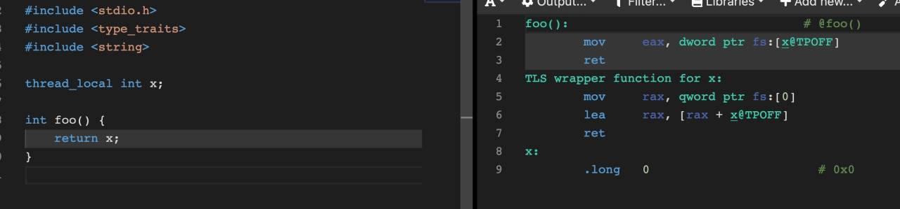

# ThreadLocal与其实现

C++ `thread_local` 及 C `_Thread_local` 变量（线程局部变量， _thread local variables_ ）相关注记
- 存储所用的空间（线程局部存储， _thread local storage_ ， _TLS_ ）随线程创建而分配，随线程终止而释放。
- 线程局部变量的初始化在 TLS 分配后、线程函数执行前进行，同样地析构在线程函数退出后、 TLS 释放前执行。初始化顺序类似全局（静态存储期的命名空间/类作用域）变量和函数内的静态存储期变量。
- 通常实现上，每个线程所拥有的线程局部存储大小及布局均相同，且在编译时确定，而线程局部变量的访问方式是通过编译时确定的偏移加存储于特定寄存器的 TLS 基址（如图）。
